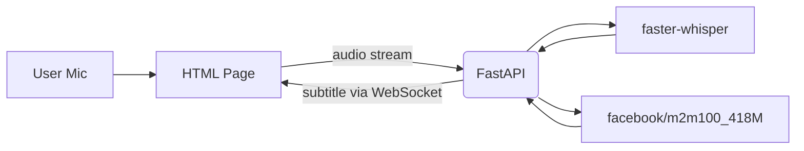

# Architecture

ユーザーが一人の簡単なデモであるため、データベースや認証は採用していません。インフラはDockerのみで構築します。

## 技術スタック
- フロントエンド: シンプルなHTML（フレームワークなし）
- バックエンド: FastAPI + WebSocket
- インフラ: Docker
- その他: faster-whisper + facebook/m2m100_418M翻訳モデル

## システム構成図

## 選択理由
- HTML: フレームワークを使わずに最小限の実装で済ませられ、学習コストが低い
- FastAPI: Python製で軽量・非同期処理に強く、リアルタイム処理に向いている
- WebSocket: 認識～翻訳～表示までのリアルタイム性を確保するための双方向通信
- Docker: 開発とデモ実行時に同一環境を構築し、運用を簡素化する
- faster-whisper: CPUでも動作するオープンソースSTTで、無料かつ高精度
- facebook/m2m100_418M: 多言語対応のオープンソース翻訳モデルで、英日相互翻訳を高品質に実現できる
