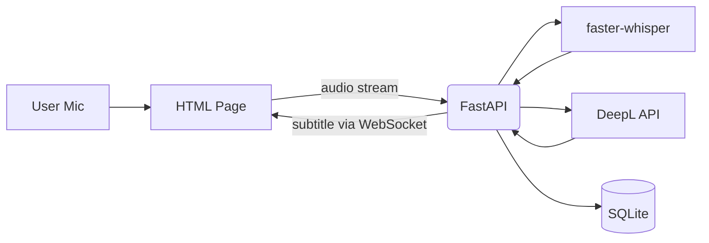

# Architecture

## 技術スタック
- フロントエンド: シンプルなHTML（フレームワークなし）
- バックエンド: FastAPI + WebSocket
- データベース: SQLite
- 認証: APIキー認証（FastAPI Security）
- インフラ: Docker + Render（Free Tier）
- その他: faster-whisper + DeepL API Free

## システム構成図

## 選択理由
- HTML: フレームワークを使わずに最小限の実装で済ませられ、学習コストが低い
- FastAPI: Python製で軽量・非同期処理に強く、リアルタイム処理に向いている
- WebSocket: 認識～翻訳～表示までのリアルタイム性を確保するための双方向通信
- SQLite: ファイルベースでセットアップが簡単、翻訳履歴保存の要件に十分対応
- APIキー認証: 個人利用向けに最小限のセキュリティを確保でき、構築コストも低い
- Docker: 開発と本番で同一環境を構築し、運用を簡素化する
- Render（Free Tier）: 無料枠で小規模アプリを常時稼働でき、低コストでの運用が可能
- faster-whisper: CPUでも動作するオープンソースSTTで、無料かつ高精度
- DeepL API Free: 高精度翻訳を無料枠で利用でき、コストを抑えつつ要件を満たせる
